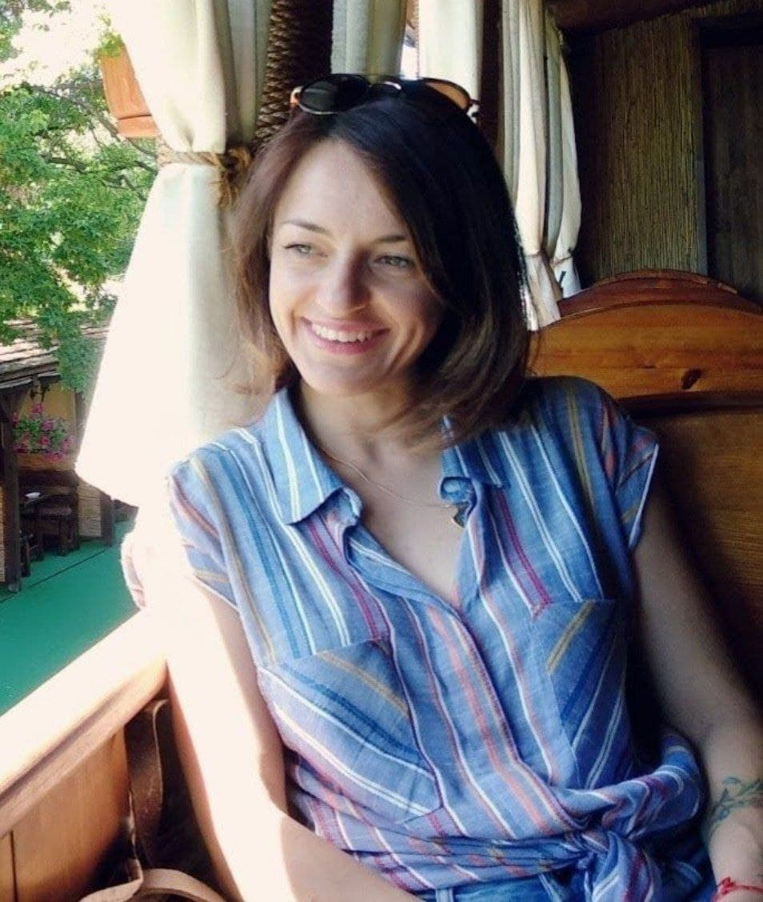

# Yana Myroniak

## junior frontend developer

### Summary

I`m looking for a full-time position remotely or in the office as a junior front-end developer. Willing to work as a part of a team on different projects and improve my skills.\
Also have experience as a Scrum Master.\
Сompleted an internship in "ZenBit".

### Tech skills

- HTML5/CSS3/SASS
- Cross-platform/Responsive Layouts
- GIT
- JavaScript
- React
- Redux
- Node.js
- REST API
- TypeScript
- NestJS
- Jira

### Soft skills

- Cooperative
- Hardworking
- Multitasking
- Creative thinking

### Education

Institute of Tourism Federation of Trade Unions Ukraine\
2004 - 2009\
Specialist | Organization management.

### Work experience

**Intern full stack developer**
**ZenBit | 12.2022-01.2023**

- Development of a job search application

Used: React, Next.js, Typescript, Redux, libraries

### Projects

**[IceCream](https://yana-mironyak.github.io/ice-cream), [git](https://github.com/yana-mironyak/ice-cream) (HTML, SASS, JS, responsive layout)**
Company site with a tasty design.\
Team project.

**[Filmoteka](https://yana-mironyak.github.io/filmoteka/), [git](https://github.com/yana-mironyak/filmoteka) (HTML, SASS, JS, Axios, REST API)**
App for searching movie.\
Team project.

**[Petly](https://project-group-4-petly.netlify.app/petly-project-fe), [git](https://github.com/Max-Loktionov/petly-project-fe) (JS, React, Redux, Node, Express, MongoDB)**
App that helps to take care of pets and find them a home.\
Team project.

**[Job search site](http://client-zb5-freelance.s3-website.eu-central-1.amazonaws.com/), [git](https://github.com/yana-mironyak/syntactic-sugar_frontend) (React, Redux, NestJS, TypeScript)**
Internship project.

### Languages

Ukrainian - native\
Russian - native\
English - Intermediate

### Aditional Education

IT School GoIT (Kyiv)\
2021-2022 | Full Stack Developer

### Contact information

+380954361364
yanika.mironyak@gmail.com
[GIT](https://github.com/yana-mironyak)
[linkedin](https://www.linkedin.com/in/yana-myroniak-02126a239/)
discord - Nesmeyana (@yana-mironyak)
Kyiv, Ukraine
